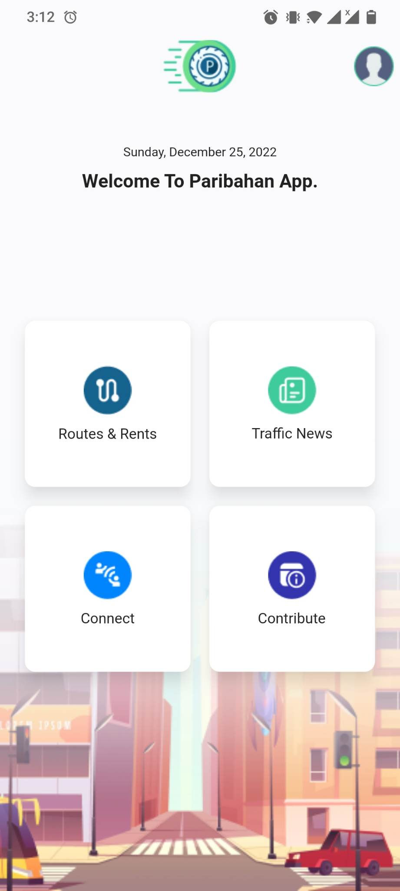

# paribahan app implementation in Flutter (WIP)

- [Public prototype](https://www.figma.com/proto/Zgk9lgbsG8FUojB5LFs39q/Paribahan?node-id=67%3A1037&scaling=scale-down&page-id=0%3A1&starting-point-node-id=67%3A1037)

